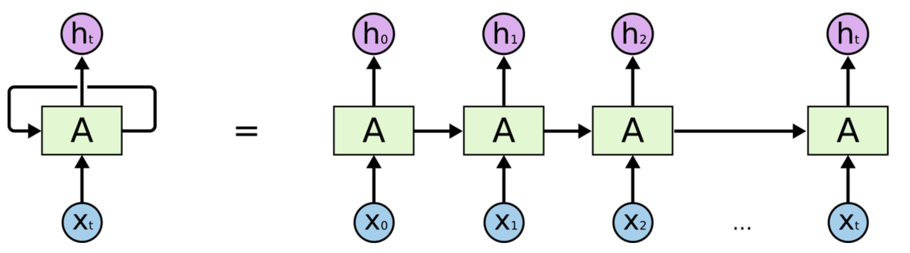

# LSTM

## RNN
RNN展开

## LSTM
- 一个细胞状态：$C_t$
- 两个激活函数：sigmoid/tanh
- 三个门：遗忘门/输入门/输出门

### LSTM计算流程
对于t时刻，输入为：$h_{t-1}$,$C_{t-1}$,$x_t$，输出为：$h_t$,$C_t$

1. 遗忘门计算：$f_t = \sigma(W_f[h_{t-1}, x_t] + b_f)$
2. 输入门计算：$i_t = \sigma(W_i[h_{t-1}, x_t] + b_i)$
3. 候选值信息：$C_t^{'} = tanh(W_c[h_{t-1}, x_t] + b_c)$
4. 更新细胞状态：$C_t = f_t * C_{t-1} + i_t * C_t^{'}$
5. 输出门：$o_t = \sigma(W_o[h_{t-1}, x_t] + b_o)$
6. 输出信息：$h_t = o_t * tanh(C_t)$

